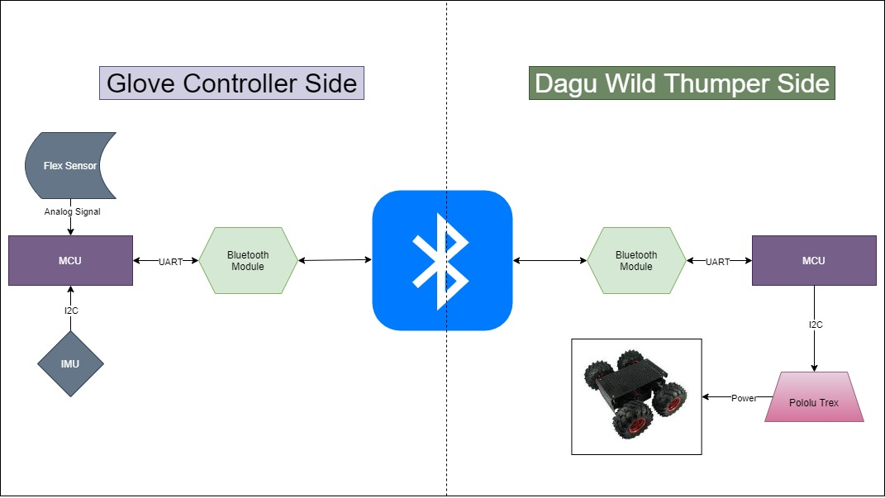
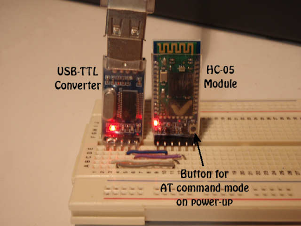
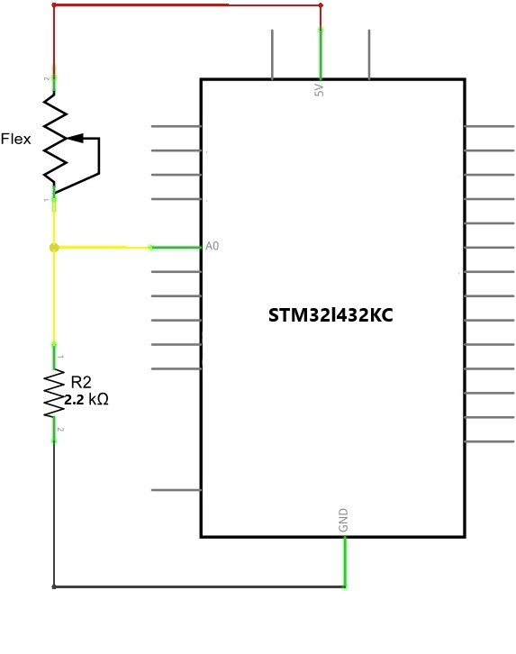
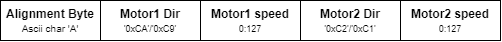

# ES_project2

## Project Motivation

Replicating human movements is highly desired in many applications, for instance, cooking robots. There exist a multitude of sensors that provide means to acquire signals that could resemble the motion done by humans. The data from those sensors could be utilized to automate some actions of those robots, for instance stirring soup, to be repeated by the robot automatically with no human in control. This project represents an illustration of this concept through translating certain hand gestures into motion done by a 4WD robot.

## Project Idea

Our project aims at utilizing hand gestures for control. We will be controlling a car kit (Dagu 4WD) using a glove that has sensors and an embedded MCU. We use a mixture of flex sensors and an Inertial measurement unit (IMU) inside the glove to determine the hand movement. We use the STM32 Nucleo board to interact with the sensors. Moreover, it communicates  the desired car movements to another Nucleo-32 board in the Dagu kit using a bluetooth module via UART. The on-ground Nucleo-32 will signal the Pololu motor controller to move the Dagu in the correct direction.

We plan to implement 5 gestures:
-  open palm for stopping/braking 
-  closed fist + downwards rotate (pitch angle) for forward
-  closed fist + upwards rotate (pitch angle) for reverse
-  closed fist + left rotate (roll angle) for left
-  closed fist + right rotate (roll angle) for right

## Hardware Components 

### Microcontroller 

STM32 Nucleo-32: STM32L432KC x2

### Car Kit

Dagu Wild Thumper 4WD

Pololu TReX Dual Motor Controller: DMC01

### Communication 

Bluetooth Module: HC-05 x2

### Sensors 

Flex sensor 56mm

Inertial measurement unit (IMU): BNO055

## Software Components 

Keil uVision 5

STM 32 Cube programmer 

## Used Architecture

## Interfacing with the Bluetooth module

Initially, we planned to use two of the HC-05 Bluetooth modules for communication between the Glove and the Dagu. However, we understood later that the HC-06 modules are Slave only modules, meaning they cannot initiate a connection to send/receive data over without the presence of a Master module. Thus, we went for using two HC-05 Modules instead, which can operate in either master or slave modes.
 
The HC-05 modules were configured using AT commands to pair with each other and set a common UART baud rate. The baud rate used is 9600.
 

 

## Glove Controller Side
### Implementation Specs

For this side we used 3 different peripherals of the MCU; ADC, UART, and I2C, to interface with different sensors. 
#### ADC
ADC1 peripheral is used to get readings from the flex sensor. The flex sensor acts like a variable resistor whose resistance changes by flexing it. It produces analog readings within a certain voltage that are handled by the ADC. Bending the sensor in different directions has a different effect on the value read from the ADC output. One direction increases the readings while the other reduces them significantly. After connecting the sensor we tested it in different voltage divider circuits until we tuned the sensor values to certain thresholds at bent and neutral positions. 

#### I2C 
I2C3 peripheral is used to interface with the BNO055 IMU sensor. This sensor produces angular values for its current orientation in 3 directions. We used Two of the given reading values for our purpose; the Pitch and Roll. 
The BNO055 sensor has on-board DSP chip, so it sends over the I2C connection the accurate digital values of the current orientation. 
For interfacing with the sensor we used [this](https://github.com/ivyknob/bno055_stm32) Library which is built on top of the [BNO055 standard APIs library](https://github.com/BoschSensortec/BNO055_driver) by its manufacturer. 

#### UART 
UART1 is used in connection with the Bluetooth module in order to send the motion values over UART to the Dagu 4WD. The used Baud rate for this communication is 9600. 
Sent over this connection is the motion value to be communicated to the Pololu motor controller. These motion values are encoded into a fixed size message which is the string values of the motion bytes. An alignment byte is sent at the beginning of the message such that the receiver can aim to receive the complete message from start to end.
  

### API Details

The main driver function for the glove side is 
`void command_dagu(void)` 
Inside this function, the data from the flex sensor is read. if the read value exceeds the neutral threshold to indicate "neutral", it proceeds to send braking motion bytes to the Dagu. Otherwise, on receiving "bent" values the function proceeds to read values from the IMU sensor to check if the angels indicate forward motion or rotation. The speed values are made proportional to the IMU angel readings (Greater angel leads to higher speed in a certain direction) 

## Dagu 4WD Side
### Implementation Specs

For this side only the UART peripheral was used. UART1 is used in connection to the HC-05 bluetooth module, while UART2 is used to communicate motion values to the Pololu Motor controller. 

#### UART1
This UART is configured at baud rate 9600. The UART1 Interrupts are enabled as it recieves the motion values from the glove asynchronously. The procedure inside the UART handler is designed to be as small and efficient as possible to prevent UART Overrun errors. Only the data recieving is done inside the handler, while adjusting and sending the data is done inside the main loop. 

#### UART2
This UART is configured at Baud rate 19200 to send the motion bytes to the Pololu motor controller. Sending via this UART is done inside the main loop.

# insert Interrupt handler code & main loop code

### API Details
This side has two main drivers; `void dagu_digest(void)` and `void receive_data(void)`.

`void receive_data(void)`

This function is called inside the UART1 ISR to recieve the motion data into a fixed size array. The `__HAL_UART_DISABLE_IT` is called before it to prevent ISR errors, then `__HAL_UART_ENABLE_IT` is called to re-enable the interrupt after the recieving is finished. Data alignment is settled inside the function.

`void dagu_digest(void)`

This function is called inside the main loop after setting the sending flag. inside `dagu_digest` the recieved char values for the motion bytes are converted into intgers that are then sent to the Pololu via UART2.

## Technical Challenges 

## First Demo Video
[Hand Gesture Driven Dagu Demo](https://drive.google.com/file/d/1rHvJYfV3ZO3Wg04cuTE-szriirWaFO4K/view?usp=sharing) //insert demo link

## Potential enhancements 

### Automatic Replay/Repeat

Using another gesture/button in order to record a sequence of movements of the kit and then replay these movements automatically on gesturing. 

### Implementing a PID control loop

The proportional–integral–derivative (PID) control loop will provide angular feedback to the on-ground MCU in order to adjust the movement of the Dagu to specifically the desired angel. It will also revert the Dagu into its original stance in case any obstacles try to divert it.   

This will enhance Dagu stability and response accuracy to the gestures. In addition, it will eliminate the effect of external obstacles and diversions. 

## Foreseen  limitations

- Limited range of the Bluetooth communication modules, the kit has to be operated in close-range

- No encoders on the Dagu motors, this makes re-mapping or automation inaccurate

- No optimized or stable glove with allocated space for the components

## Planned milestones 

-	April 22nd: Acquired the components 
-	April 24th: implemented & tested communication 
-	April 26th: tested & tuned the sensors
-	April 29th: Integrated system 
-	May 2nd: Testing and Tuning the whole system + debugging 

