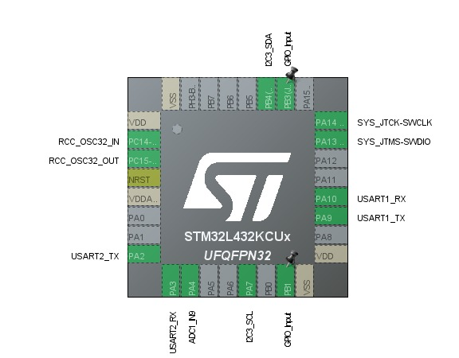
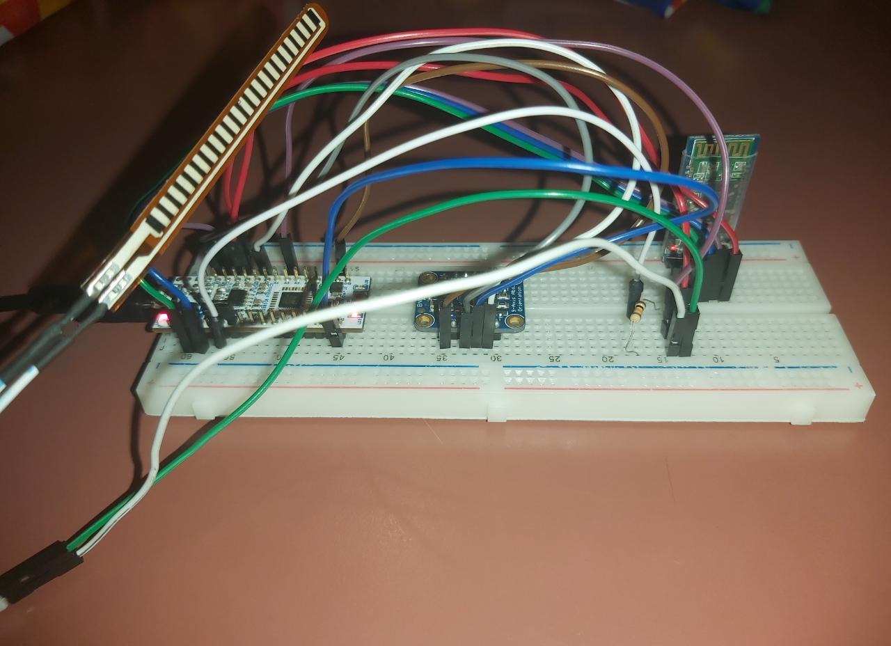
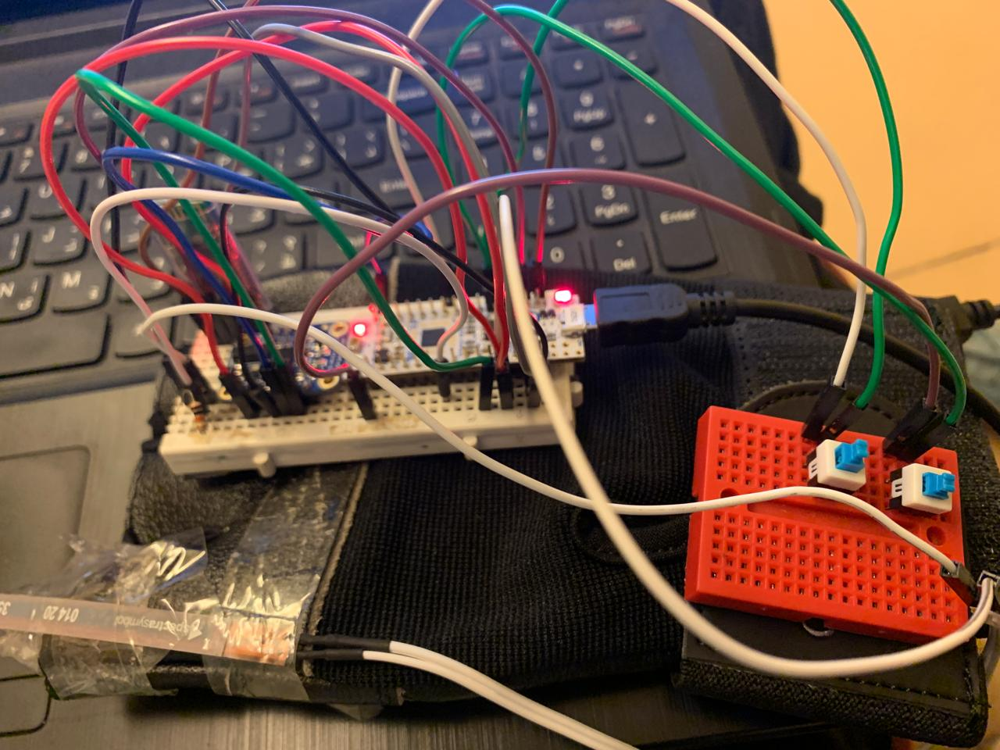
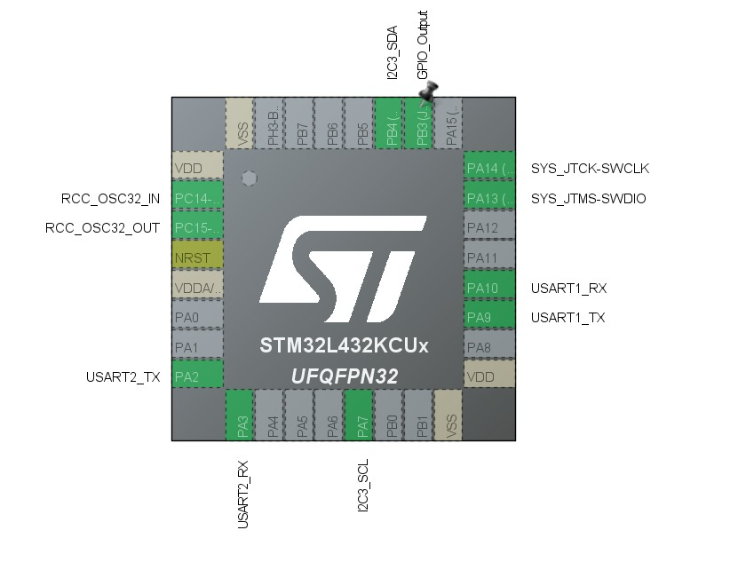
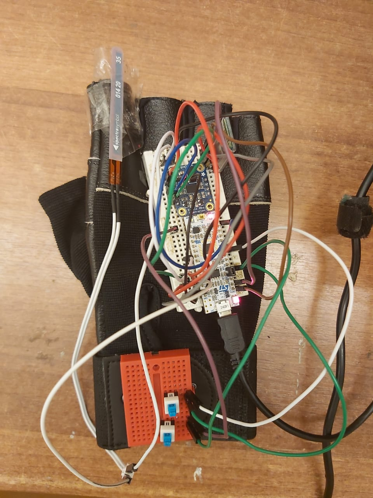

# ES_project2

## Project Motivation

Replicating human movements is highly desired in many applications, for instance, cooking robots. There exist a multitude of sensors that provide means to acquire signals that could resemble the motion done by humans. The data from those sensors could be utilized to automate some actions of those robots, for instance stirring soup, to be repeated by the robot automatically with no human in control. This project represents an illustration of this concept through translating certain hand gestures into motion done by a 4WD robot.

## Project Idea


Our project aims at utilizing hand gestures for control. We will be controlling a car kit (Dagu 4WD) using a glove that has sensors, buttons and an embedded MCU. We use a mixture of flex sensor and an Inertial measurement unit (IMU) inside the glove to determine the hand movement. We also used 2 button for the record and replay features. We use the STM32 Nucleo board to interact with the sensors. Moreover, it communicates  the desired car movements to another Nucleo-32 board in the Dagu kit using a bluetooth module via UART. The on-ground Nucleo-32 will signal the Pololu motor controller to move the Dagu in the correct direction. We also implemented a PID control loop using another IMU in the Dagu kit to enhance Dagu stability and response accuracy to the gestures.

Our project has 7 basic gestures:
-  open palm for stopping/braking 
-  closed fist + downwards rotate (pitch angle) for forward
-  closed fist + upwards rotate (pitch angle) for reverse
-  closed fist + left rotate (roll angle) for left
-  closed fist + right rotate (roll angle) for right
-  record button to record the gestures
-  replay button to play the recorded gestures.


## Hardware Components 

### Microcontroller 

STM32 Nucleo-32: STM32L432KC x2

### Car Kit

Dagu Wild Thumper 4WD

Pololu TReX Dual Motor Controller: DMC01

### Communication 

Bluetooth Module: HC-05 x2

### Sensors 

Flex sensor 56mm

Inertial measurement unit (IMU): BNO055


## Software Components 

Keil uVision 5

STM 32 Cube programmer 

## Used Architecture


## Interfacing with the Bluetooth module

Initially, we planned to use two of the HC-06 Bluetooth modules for communication between the Glove and the Dagu. However, we understood later that the HC-06 modules are Slave only modules, meaning they cannot initiate a connection to send/receive data over without the presence of a Master module. Thus, we went for using two HC-05 Modules instead, which can operate in either master or slave modes.
 
The HC-05 modules were configured using AT commands to pair with each other and set a common UART baud rate. The baud rate used is 9600.

### Slave Configuration
- AT+RMAAD  (Clear any paired devices)
- AT+ROLE=0 (Set as slave)
- AT+ADDR   (Get address of the HC-05 slave module to provide to the master)
- AT+UART=9600,1,0 (Select a baud rate of 9600)

### Master Configuration
- AT+RMAAD (Clear any paired devices)
- AT+ROLE=1 (Set as master)
- AT+CMODE=0 (To connect the module to the specified Bluetooth address and this Bluetooth address can be specified by the binding command)
- AT+BIND=xxxx,xx,xxxxxx (bind to the address of the slave module)
- AT+UART=9600,1,0 (Select a baud rate of 9600)


 


## Glove Controller Side


### Implementation Specs

For this side we used 4 different peripherals of the MCU; ADC, UART, I2C, and GPIO to interface with different sensors. 
#### ADC
ADC1 peripheral is used to get readings from the flex sensor. The flex sensor acts like a variable resistor whose resistance changes by flexing it. It produces analog readings within a certain voltage that are handled by the ADC. Bending the sensor in different directions has a different effect on the value read from the ADC output. One direction increases the readings while the other reduces them significantly. After connecting the sensor we tested it in different voltage divider circuits until we tuned the sensor values to certain thresholds at bent and neutral positions. 


#### UART 
UART1 is used in connection with the Bluetooth module in order to send the motion values over UART to the Dagu 4WD. The used Baud rate for this communication is 9600. 
Sent over this connection is the motion value to be communicated to the Pololu motor controller. These motion values are encoded into a fixed size message which is the string values of the motion bytes. An alignment byte is sent at the beginning of the message such that the receiver can aim to receive the complete message from start to end.
  


#### I2C 
I2C3 peripheral is used to interface with the BNO055 IMU sensor. This sensor produces angular values for its current orientation in 3 directions. We used Two of the given reading values for our purpose; the Pitch and Roll. 
The BNO055 sensor has on-board DSP chip, so it sends over the I2C connection the accurate digital values of the current orientation. 
For interfacing with the sensor we used [bno055_stm32-master](https://github.com/ivyknob/bno055_stm32) Library which is built on top of [BNO055 standard APIs library](https://github.com/BoschSensortec/BNO055_driver) specifically for the STM32 MCUs. 


### GPIO

Two pins from GPIOB are used to implement the record replay buttons. GPIOB Pin 3 is used to record the gestures of the glove using the funciton `start_recording(void)` and GPIOB pin 1 is user to replay the recorded gestures from the glove using the funciton `replay_recorded()`. 

### API Details

The main driver function for the glove side is 
`void command_dagu(void)` 
Inside this function, the data from the flex sensor is read. if the read value exceeds the neutral threshold to indicate "neutral", it proceeds to send braking motion bytes to the Dagu. Otherwise, on receiving "bent" values the function proceeds to read values from the IMU sensor to check if the angles indicate forward motion or rotation. The speed values are made proportional to the IMU angle readings (Greater angle leads to higher speed in a certain direction) 

### Glove Systick Handler
we modified the systec handler so that we can set a counter for taking samples per suitable time.

```
void SysTick_Handler(void)
{
  /* USER CODE BEGIN SysTick_IRQn 0 */
	extern int  sample_counter;
	sample_counter++;

  /* USER CODE END SysTick_IRQn 0 */
  HAL_IncTick();
  /* USER CODE BEGIN SysTick_IRQn 1 */

  /* USER CODE END SysTick_IRQn 1 */
}

```

### Connections 




## Dagu 4WD Side



### Implementation Specs

For this side, we used the UART peripheral and I2C3. UART1 is used in connection to the HC-05 bluetooth module, while UART2 is used to communicate motion values to the Pololu Motor controller. In addition, the IMU is connected to I2C3 to implement the PID control loop.

#### UART1
This UART is configured at baud rate 9600. The UART1 Interrupts are enabled as it receives the motion values from the glove asynchronously. The procedure inside the UART handler is designed to be as small and efficient as possible to prevent UART Overrun errors. Only the data receiving flag is raised inside the handler, while receiving, adjusting and sending the data is done inside the main loop. 

#### UART2
This UART is configured at Baud rate 19200 to send the motion bytes to the Pololu motor controller. Sending via this UART is done inside the main loop.

```
void USART1_IRQHandler(void)
{
	extern volatile int rec_flag;
	rec_flag = 1;
	__HAL_UART_DISABLE_IT(&huart1,UART_IT_RXNE);
  HAL_UART_IRQHandler(&huart1);
}
```

```
__enable_irq();
	__HAL_UART_ENABLE_IT(&huart1, UART_IT_RXNE);
  while (1)
  {
		if(rec_flag == 1)
		{
				receive_data();
		}
  }
```


### API Details
This side has two main drivers; `void dagu_digest(void)` and `void receive_data(void)`.

`void receive_data(void)`

This function is called inside the main loop to receive the motion data into a fixed size array, it is called after the receiving flag is raised inside the UART ISR. The `__HAL_UART_DISABLE_IT` is called before it to prevent ISR errors, then `__HAL_UART_ENABLE_IT` is called to re-enable the interrupt after the recieving is finished. Data alignment is settled inside the function.

`void dagu_digest(void)`

This function is called inside the `receive_data` function. inside `dagu_digest` the received char values for the motion bytes are converted into intgers that are then sent to the Pololu via UART2.

 
## Basic Hand-Gestures video:
[Hand Gesture Driven Dagu Demo](https://drive.google.com/file/d/1osNEbPCETx6UBfbIYG2R1vcQnqG6cy6l/view?usp=sharing) 

## Other Features

### Automatic Replay/Repeat
Using two buttons, the record button is used to record the hand-gestures as it records (sample) a sequence of movements of the kit for a specific time duration and then replay these movements automatically when pressing the replay button. to implement this, `void start_recording()` and `void play_recorded()` functions were implemented. On pressing GPIOB Pin 3, the function `start_recording()` is called and the movements are saved inside an array. On pressing GPIOB Pin 1, the function `play_recorded()` is called and the sequence of movements are played from the recorded array and it keeps repeating the sequence of monvments untill the replay button is released. 

### PID control loop

The proportional–integral–derivative (PID) control loop provides angular feedback to the on-ground MCU in order to adjust the movement of the Dagu to specifically the desired angle. It also reverts the Dagu into its original stance in case any obstacles try to divert it. This feature enhances Dagu stability and response accuracy to the gestures. In addition, it eliminates the effect of external obstacles and diversions.

### Glove prototyping
We designed a glove equipped with the specified components to ease the control of the dagu



## Final Hand-Gestures video:
[Hand Gesture Driven Dagu Demo](https://drive.google.com/file/d/1Cj_-AGyR_HFJMkBtRRDh9JXT5KEECCbx/view?usp=drivesdk)

## limitations of the project

- Limited range of the Bluetooth communication modules, the kit has to be operated in close-range

- No encoders on the Dagu motors, this makes re-mapping or automation inaccurate

- Limited memory size which limits the duration of recording the gestures.


