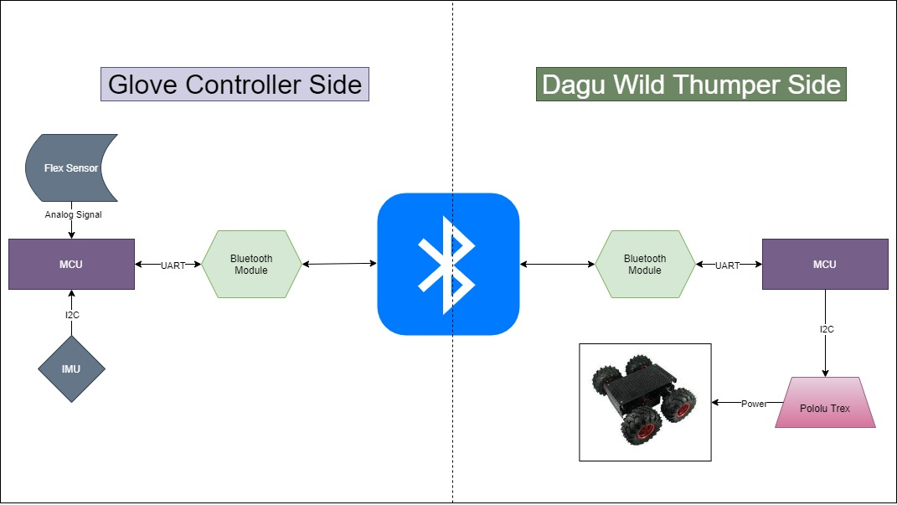

# ES_project2

## Project Idea

Our project aims at utilizing hand gestures for control. We will be controlling a car kit (Dagu 4WD) using a glove that has sensors and an embedded MCU. We use a mixture of flex sensors and an Inertial measurement unit (IMU) inside the glove to determine the hand movement. We use the STM32 Nucleo board to interact with the sensors. Moreover, it communitcates the desired car movements to another Nucleo-32 board in the Dagu kit using a bluetooth module via UART. The on-ground Nucleo-32 will signal the Pololu motor controller to move the Dagu in the correct direction.

We plan to implement 5 gestures:
-  open palm for stopping/braking 
-  closed fist + downwards rotate (pitch angle) for forward
-  closed fist + upwards rotate (pitch angle) for reverse
-  closed fist + left rotate (roll angle) for left
-  closed fist + right rotate (roll angle) for right

## Components 

### Microcontroller 

STM32 Nucleo-32: STM32L432KC x2

### Car Kit

Dagu Wild Thumper 4WD

Pololu TReX Dual Motor Controller: DMC01

### Communication 

Bluetooth Moduel: HC-06 x2

### Sensors 

Flex sensor 56mm

Inertial measurement unit (IMU): BNO055

## Software Components 

Keil uVision 5

STM 32 Cube programmer 

## Proposed Architecture

## Proposed Schematic

## Potential enhancements 

### Automatic Replay/Repeat

Using another gesture/button in order to record a sequence of movements of the kit and then replay these movements automatically on gesturing. 

### Implementing a PID control loop

The proportional–integral–derivative (PID) control loop will provide angular feedback to the on-ground MCU in order to adjust the movement of the Dagu to specifically the desired angel. It will also revert the Dagu into its original stance in case any obstacles try to divert it.   

This will enhance Dagu stability and response accuracy to the gestures. In addition, it will eliminate the effect of external obstacles and diversions. 

## Foreseen  limitations

- Limited range of the Bluetooth communication modules, the kit has to be operated in close-range

- No encoders on the Dagu motors, this makes re-mapping or automation inaccurate

- Manufacturing a more stable glove with allocated space for the components

## Planned milestones 